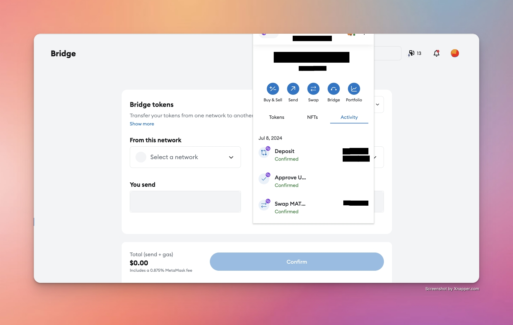

# Technology and Infrastructure

## **Bridging**

How to collect: Find the address of the cross-chain bridging smart contract on the official website of the cross-chain project. Use a blockchain browser to query the transaction records of the relevant contracts to understand the cross-chain fund flow.

* **Example 1:** Visit [Wrapped Bitcoin ](https://wbtc.network/)(WBTC) project and use [Etherscan ](https://etherscan.io/)or [PolygonScan ](https://polygonscan.com/)to check the cross-chain transaction record.

<figure><figcaption></figcaption></figure>

* **Example 2:** Visit [Polkadot](https://polkadot.network/) and use [Polkascan ](https://explorer.polkascan.io/)or [Subscan ](https://polkadot.subscan.io/)to query cross-chain transactions.

<figure><figcaption></figcaption></figure>

* **Example 3:** After completing a cross-chain bridge transaction in your wallet, you can find the transaction details in the history log and record the relevant information.

<figure><figcaption></figcaption></figure>

## **Eth 2 Staking**

How to collect: The addresses of Ethereum 2.0 staking can usually be found on the relevant websites of the [Ethereum 2.0 Beacon Chain](https://ethereum.org/en/roadmap/beacon-chain/).

* **Example 1:** Visit [Ethereum 2.0 Beacon Chain](https://ethereum.org/en/roadmap/beacon-chain/)

<figure><figcaption></figcaption></figure>

* **Example 2:** Using the Ethereum 2.0 blockchain browser to query the smart contract addresses of validators and stakers.

## **Genesis**

How to collect: Genesis addresses are usually found on the blockchain browser because they are the starting point of every blockchain network. To find these addresses, you can use the blockchain browser to query.

* **Example 1:** Use the [Ethereum blockchain browser](https://etherscan.io/) to view the genesis block information of the Ethereum network and obtain the genesis address.
* **Example 2:** Use the [Polkadot ](https://polkadot.network/)blockchain browser to query genesis block information of the Polkadot network.

## **ICO**

How to collect: Visit the official website or ICO listing website of a specific ICO project to find an ICO address. These websites provide ICO address information and details of token sales.

* **Example:** [Polkadot Project ](https://polkadot.network/)ICO Address: Visit the Polkadot Project's official website to find the address of its token sale.

## **Infrastructure**

How to collect: Finding infrastructure-related addresses typically requires visiting the official website of a particular project to view its infrastructure smart contract address or related information.

* **Example 1:** [Ethereum ](https://etherscan.io/)Infrastructure Smart Contracts: Visit Ethereum's official website to find its infrastructure smart contract address.
* **Example 2:** [IPFS ](https://ipfs.tech/)Infrastructure Smart Contracts: Find the official website of the IPFS project for its smart contract address.

<figure><figcaption></figcaption></figure>

## Layer 2 Extension

How to collect: Finding addresses related to layer 2 extensions typically requires visiting the official website of an Ethereum or other blockchain project to view its layer 2 extension smart contract address.

* **Example 1:** [Optimistic Ethereum ](https://optimistic.etherscan.io/)Smart Contracts: Visit the official website of Optimistic Ethereum to find its second layer extension smart contract address.

<figure><figcaption></figcaption></figure>

* **Example 2:** [zkSync Smart Contracts:](https://docs.zksync.io/) Find the official website of the zkSync project to see its Layer 2 extension smart contract address.

## MEV Bot

How to collect: To find the address of the MEV Bot, you can refer to the Lightning Network community, research papers, or blockchain security reports, which typically provide information about the MEV Bot.

* **Example 1:** Visit the official [Flashbots](https://www.flashbots.net/) website for information about the Lightning Network MEV Bot.

<figure><figcaption></figcaption></figure>

* **Example 2:** Find blockchain research tools like [MEV-Explore](https://explore.flashbots.net/) to understand the activities of the MEV Bot.

## **Mining Pool**

How to collect: The mining pool address can usually be found on the mining pool's official website. In addition, you can also check the mining pool information on the blockchain browser, which is usually publicly available.

* **Example 1:** Visit the official website of [F2Pool](https://f2pool.io/mining/guides/how-to-mine-bitcoin/) to see its mining pool address and the mining services it offers.

<figure><figcaption></figcaption></figure>

* **Example 2:** Search for the [Ethermine](https://ethermine.org/) pool in the blockchain browser to see its related information and mining address.

<figure><figcaption></figcaption></figure>

## **Multichain**

How to collect: Monitoring multichain interoperability addresses may require checking the official documentation or blockchain browser of the multichain interoperability project. Understand the multi-chain interoperability protocol to identify its cross-chain interaction addresses.

* **Example 1:** Visit the official documentation of the [Wrapped Bitcoin](https://wbtc.network/) project to learn how to interact with the interworking address between Bitcoin and Ethereum.
* **Example 2:** Find the [Cosmos Hub](https://hub.cosmos.network/main/getting-started)'s cross-chain address to understand the interoperability between different blockchains in the Cosmos ecosystem.

## **Oracle**

How to collect: Familiar with the address of an Oracle often requires looking at the official documentation of a particular Oracle project or a blockchain browser for information about its data sources and interactions.

* **Example 1:** Check [Chainlink](https://chain.link/education/blockchain-oracles)'s official documentation to learn how to use its Oracle service and find relevant address and contract information.

<figure><figcaption></figcaption></figure>

* **Example 2:** Find the oracle address of the [Band Protocol](https://www.bandprotocol.com/) and view its documentation for information about the data source.

<figure><figcaption></figcaption></figure>

## **Proxy**

How to collect: To find the address related to the proxy, you can check the proxy service provider's website to learn about the proxy services it offers and the corresponding address.

* **Example 1:** Visit the official website of [ProxyMesh](https://proxymesh.com/) or other service providers to learn about the addresses and usage instructions of their different proxy nodes.

<figure><figcaption></figcaption></figure>

* **Example 2:** Understand how to use the [Tor](https://www.torproject.org/) network to obtain addresses and configuration information for anonymous browsing and communication.

<figure><figcaption></figcaption></figure>

## **Router**

How to collect: To find the address related to the router, you can check the official documentation and community discussions of the blockchain router project for relevant information.

* **Example 1:** Visit the official documentation of blockchain router projects such as [Connext](https://www.connext.network/) to learn about their addresses and routing services.

<figure><figcaption></figcaption></figure>

* **Example 2: State Channels Community:** Participate in community discussions related to state channels and blockchain routers to gain insights on addresses and technologies.

## **Sidechain**

How to collect: To find the address related to the sidechain, you can check the official documentation of the sidechain project and the blockchain browser to understand its address and interoperability scheme.

* **Example 1:** Visit the official documentation of Polygon (MATIC) for information about sidechain addresses and interoperability.
* **Example 2:** Use the Ethereum blockchain browser to view transactions and addresses related to sidechain interoperability.

## **Staking**

How to collect: To find the address related to staking, you can check the official information of staking platforms and tokens on blockchain.

* **Example 1:** Visit the Tezos Staking Platform for information about Tezos staking addresses.
* **Example 2:** Check out the staking tokens in the Cosmos ecosystem for related addresses.

## **Token Sale**

How to collect: To find an address related to the token sale, you can participate in the token sale event, check the token sale platform, or read the official notices.

* **Example 1:** Participate in the token sale on the token sale platform to see the token address assigned to you.
* **Example 2:** Follow the token project's official social media and notifications to get the token sale address and details.

## **Token Team**

How to collect: To find the address of the token team, you can check the official team page and social media information.

* **Example 1:** Visit the token project's official website to view the team members' addresses and information.
* **Example 2:** Follow the social media accounts of the token project team members to learn about their addresses and activities.

## **Validator**

How to collect: To find the address related to the validator, you can look at the validation node information on the PoS (Proof of Stake) blockchain.

* **Example 1:** View the list of validation nodes on the Cosmos blockchain to understand their addresses and performance.
* **Example 2:** Study validator addresses in the Tezos Proof of Stake network.
