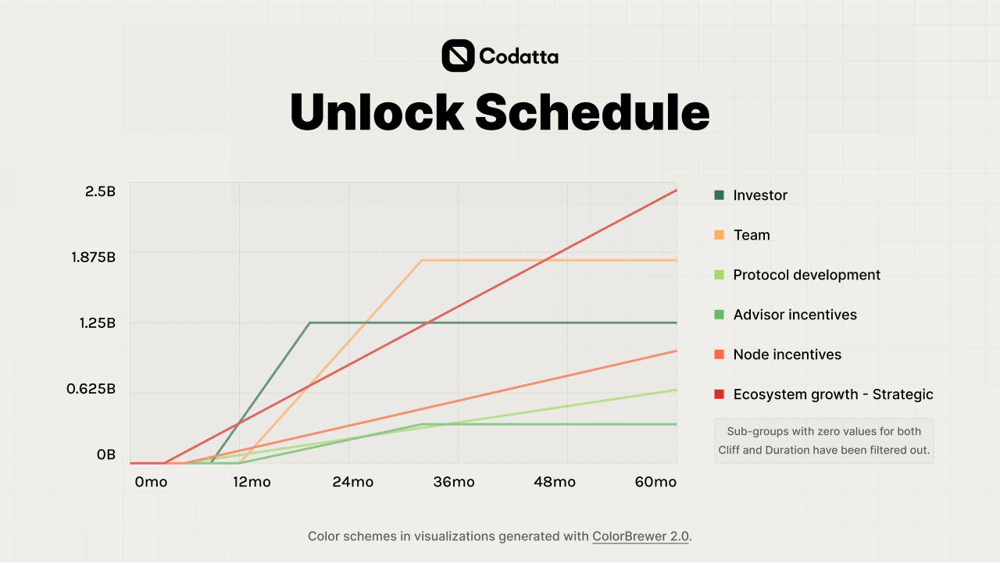

# Tokenomics

The tokenomics features a structured distribution across core stakeholders with tiered unlock schedules, combining initial cliff periods followed by linear vesting for investors, team, foundation and community allocations to align long-term incentives while maintaining ecosystem liquidity.

<figure><figcaption>
Tokenomics Distribution
</figcaption></figure>

<figure><figcaption>
Unlock Schedule
</figcaption></figure>
